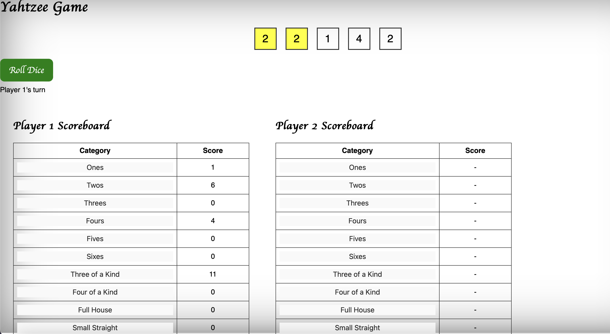
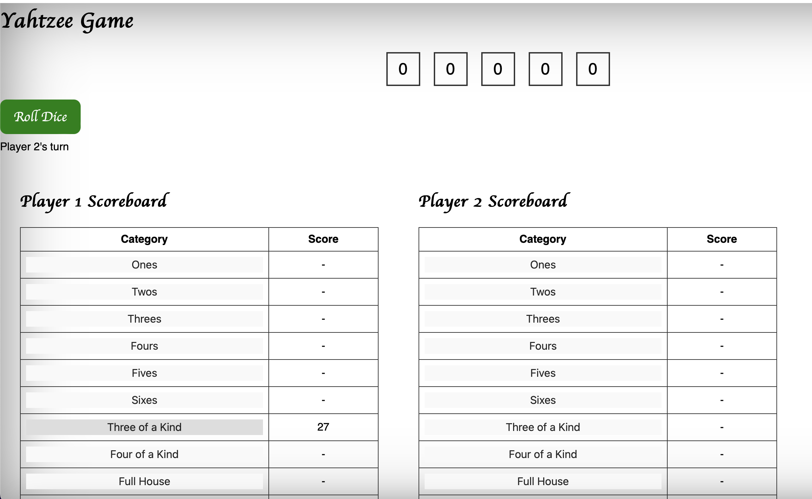

# Yatzy Game

## How to Play

1. Click "Roll Dice" to roll the five dice.
2. Click on individual dice to hold them.
3. Roll up to two more times, holding any dice you want to keep.
4. After the third roll, record your score.

## Screenshots

